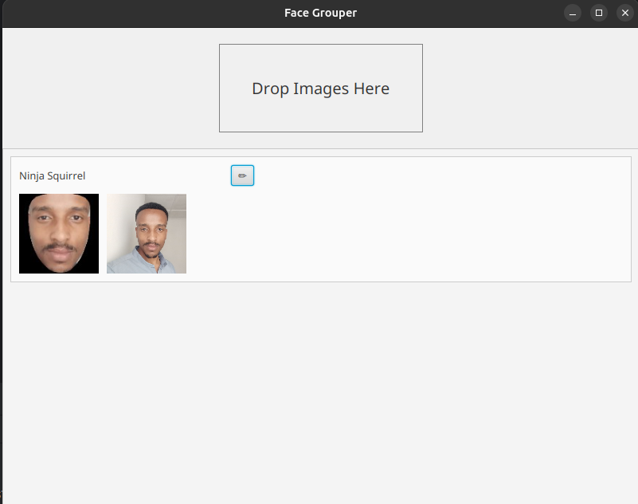

# Java Native Code with MediaPipe

This project demonstrates how to integrate MediaPipe with Java without relying on the Android SDK. The primary goal is to showcase the use of a pre-built MediaPipe shared library for face detection and recognition in a desktop Java application.



## Project Overview

The application is a simple face grouping tool. You can drag and drop images (or select them via a file chooser) onto the application window. The application will then:

1.  Detect faces in the images using MediaPipe.
2.  Extract facial embeddings.
3.  Group the faces based on their embeddings.
4.  Display the grouped faces in the UI.

## The Hard Part: JNI and Shared Libraries

The most challenging aspect of this project is building a shared library that exposes MediaPipe's functionality to Java using the Java Native Interface (JNI). This involves:

1.  **Building MediaPipe:** Compiling the MediaPipe framework into a shared library (`.so` for Linux, `.dll` for Windows, `.dylib` for macOS).
2.  **Creating JNI Bindings:** Writing C++ code that acts as a bridge between Java and the MediaPipe library. This code uses JNI to define native methods that can be called from Java.
3.  **Exposing Functionality:** Carefully selecting and exposing the necessary MediaPipe functions (e.g., for face detection, embedding extraction) to the Java side.

This project includes a pre-built shared library for Linux (`lib6.so`) in the `mediapipe` directory.

## Project Structure

```
.
├── build.gradle
├── mediapipe
│   ├── lib6.so
│   └── model.onnx
├── src
│   └── main
│       └── java
│           └── dev
│               ├── EmbeddingExtractor.java
│               ├── FaceRecognizer.java
│               ├── FunnyNameGenerator.java
│               └── Main.java
└── README.md
```

*   `build.gradle`: The Gradle build file, which defines the project's dependencies and configuration.
*   `mediapipe/lib6.so`: The pre-built MediaPipe shared library for Linux.
*   `mediapipe/model.onnx`: The ONNX model used for face recognition. **Note:** This file is not included in the repository and must be downloaded separately.
*   `src/main/java/dev/`: The Java source code for the application.
    *   `Main.java`: The main application entry point, which creates the UI and handles user interactions.
    *   `FaceRecognizer.java`: A class that encapsulates the logic for face detection and recognition, including the JNI calls to the MediaPipe library.
    *   `EmbeddingExtractor.java`: A helper class for extracting facial embeddings.
    *   `FunnyNameGenerator.java`: A utility class for generating random names for the face groups.

## How to Run

1.  **Prerequisites:**
    *   Java Development Kit (JDK)
    *   Gradle
    *   (For non-Linux users) A compatible MediaPipe shared library for your operating system.

2.  **Download the Model:**

    Download the `model.onnx` file and place it in the `mediapipe` directory.

3.  **Run the application:**

    ```bash
    ./gradlew run
    ```

    The `build.gradle` file is configured to set the `java.library.path` to the `mediapipe` directory, so the JVM can find the shared library.
